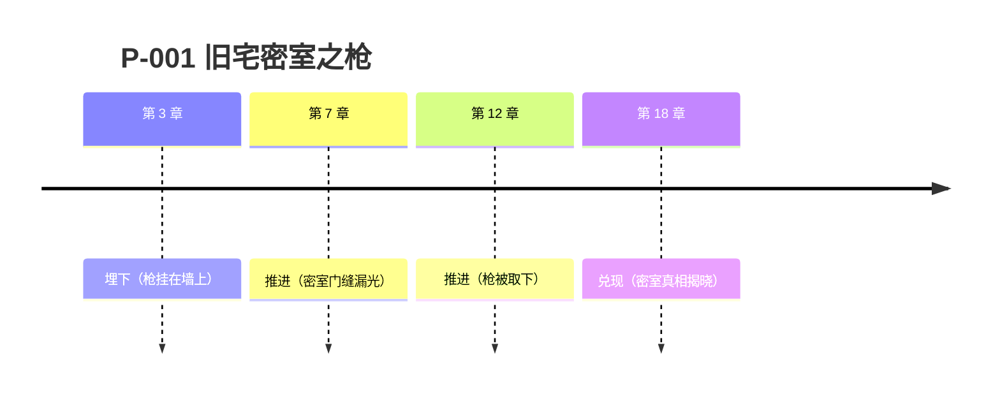

# 剧情工坊（Plot）

World State 管"世界发生了什么"，Plot 管"故事怎么讲"。两者在**场景**上咬合：每个场景锚定时间、地点、出场角色。

## 四级大纲（总纲 → 篇/卷 → 幕 → 节 → 章）

大纲按层写，每层只写本层该有的信息，不把大纲写成正文：

| 层级 | 写什么 | 不写什么 |
| --- | --- | --- |
| 总纲 | 一句话故事、核心冲突、最终走向 | 具体情节 |
| 篇/卷 | 本卷目标、起点、转折、卷末钩子 | 逐章细节 |
| 幕 | 推进节拍（升温/对峙/反转/收束） | 台词和描写 |
| 节 | 场景序列、每场戏的节奏角色 | 正文 |
| 章 | 本章目标、关键剧情点、钩子 | 逐句内容 |

章节任务书只从"章 + 所属幕 + 所属卷"三层取信息；改卷不动章、改章不动卷。

## 两棵树：结构归结构，因果归因果

- **承载树**：故事在哪里讲 —— 故事 → 卷 → 幕 → 节 → 章 → 正文。
- **因果树**：故事为什么发生 —— 故事 → 阶段 → 剧情线 → 场景。

场景归属某一章，同时属于某条剧情线。于是第 5 章的一个场景可以因果上属于三百年前的剧情线：倒叙、插叙、多线并行随便排，因果链不乱。

在 `plot/structure.md` 里维护：

```markdown
## 四级大纲
- 总纲：...
- 卷一：故城（第 1-15 章）
  - 幕一：入局（第 1-5 章，升温）
    - 节：第 1 章 - 雨夜截杀

## 承载树
- 卷一：故城（第 1-15 章）
  - 第 1 章：雨夜截杀

## 因果树
- 阶段一：启程
  - 剧情线 A：身世之谜
    - 场景：第 1 章 - 截杀者认出主角佩剑
```

## 章节关系图谱（思维链）

章节之间要有明确的逻辑链，防止写飞。每章记录三行关系：

- **回应**：本章开头回应了哪一章的钩子/悬念。
- **埋设**：本章结尾把钩子/悬念留给哪一章。
- **关系类型**：因果（A 导致 B）/ 呼应（前后镜像、母题复现）/ 并行（多线同时间推进）/ 转折（打破前文预期）。

关系足够多时画一张 mermaid 图，一眼看出断链和悬空的钩子。

## 承诺账本（伏笔 = 对读者的欠债）

每个伏笔都是一笔债，登记在 `plot/promises.md`：

```markdown
| 编号 | 承诺（许诺了什么） | 埋下章 | 推进节拍 | 兑现章 | 状态 | 类型 |
| --- | --- | --- | --- | --- | --- | --- |
| P-001 | 墙上的枪会响（旧宅密室） | 3 | 7（再次出现）/ 12（上膛） | 18 | 埋下 | 铺垫兑现 |
```

规则：

- **埋下**：写清许诺了什么、期待怎么兑现。
- **推进**：节拍挂在场景/章节上，场景状态一变，节拍状态跟着变。
- **兑现**：写到目标章必须收线；到期未兑现是最高优先级事项，写作指令里必须提示。
- **逾期提醒**：感情线想隔几章发一次糖、爽点间隔多久一次，也登记成承诺，超期必须提醒。
- 类型标签（可选）：铺垫兑现、预言、母题、镜像对照。

## 伏笔 DAG（承诺依赖图）

承诺之间常有依赖：P-B 的揭晓必须等 P-A 先兑现。账本加"依赖"列：

```markdown
| 编号 | 承诺 | 依赖 | 埋下章 | 推进节拍 | 兑现章 | 状态 |
| --- | --- | --- | --- | --- | --- | --- |
| P-008 | 佩剑的秘密 | P-003 | 12 | 20 | 33 | 推进 |
```

规则：

- 依赖未满足的兑现自动标为**阻塞**；任务书与审查必须提示阻塞项。
- 规划时先画依赖边（文字列表或 mermaid 图），再排兑现顺序，避免"读者等一个永远不揭晓的前提"。
- 同一章兑现的承诺不超过 2-3 个，避免信息过载。

## 伏笔时间线

把承诺账本按章号铺成时间线（埋下 → 推进 → 兑现），用表格或 mermaid 表达：



写作前扫一眼时间线：超期未兑现的承诺、推进密度失衡（长期不推进）都要写进本章任务书。

## 追读力系统（爽点节奏）

追读力 = 读者读完这章还愿意点下一章的概率。规划四件事：

- **钩子（Hook）**：章末钩子类型——悬念（新问题）、威胁（危险逼近）、情绪（关系张力）、信息（秘密将揭）。每章至少一个，且下章开头必须回应。
- **爽点（Cool-point）**：情绪回报点——打脸、逆袭、收获、解密、关系进展。规划密度：大爽点按卷布局，小爽点按 3-5 章分布，不能连续 10 章无回报。
- **微兑现**：给读者的小甜头——一个答案、一次小胜利、一句会心的呼应。微兑现可以低成本高频，防止弃书。
- **债务追踪**：所有欠读者的债（伏笔、糖点、爽点、未回应钩子）都在承诺账本登记，超期必提示。写到目标章自动进入写作指令。

感情线每隔几章发糖、爽点间隔多久一次，也登记成承诺——它是提醒器，不是创作枷锁。

## 创作决策记录（ADR）

`plot/decisions.md`，拍板当场存档：

```markdown
## D-004：让主角在第四卷黑化（2026-07-31）
- 决定：选方案 B——不是被杀，而是主动放弃立场。
- 动机：为第四卷的反转留伏笔；黑化由环境逼出更有说服力。
- 风险：前期读者可能弃书；与"坚持原则"的人设冲突。
- 状态：已拍板
```

- 未决事项不写死：AI 不得擅自替未决决策落地。
- 放弃方案写明原因；推翻旧决策要留痕（新记录引用旧编号）。
- 创作罗盘（`plot/罗盘.md`）的每次更新也在此留痕。

## 信息控制（悬念的工程化）

每章写作指令必须包含四组信息（希区柯克"桌下炸弹"：炸弹在桌下而角色不知，悬念才成立）：

- **读者知道**什么
- **主角知道**什么
- **必须隐瞒**什么
- **只能暗示**什么

四组全空时不要开工，先补章节指令。AI 天然上帝视角，不约束就会让角色说出不该知道的话。

## 场景字段

用于把控节奏，留空表示未填写（不要替用户猜）：

- **场景结果**：达成 / 未达成 / 无冲突 / 被动承受
- **节奏角色**：这场戏在整体节奏里承担什么（推进、蓄力、转折、余波）
- **剧情线类型（MICE）**：决定"这条线怎样才算关"——环境（milieu）/ 谜题（idea）/ 角色（character）/ 事件（event）

MICE 速查：

| 类型 | 这条线关掉的条件 |
| --- | --- |
| 环境 M | 到达/离开某个新奇环境，或环境发生根本改变 |
| 谜题 I | 谜底揭晓、疑问解答 |
| 角色 C | 角色性格发生不可逆改变 |
| 事件 E | 世界中的事件被触发并产生后果 |
